# Final Project Solution Report: Advanced Image Classification Pipeline

## 1. Project Overview & Problem Statement

This project involves the development of a highly specialized image classification pipeline designed to categorize diverse visual content into 6 distinct classes: `nature`, `trekking`, `em_bé_chơi`, `tết_festival`, `tu_họp`, and a catch-all `other` category. 

### 1.1. Technical Challenges
The primary challenge of this project lies in the **extreme scarcity and imbalance of data**. With only approximately 300 images across 6 classes, standard deep learning approaches are prone to severe overfitting. 
- **The Data Gap**: Most modern vision models (like ResNet or Swin Transformers) are designed for millions of images. Adapting these to a few hundred requires specialized training regimes.
- **Class Imbalance**: Classes like `thien_nhien` dominate the training pool, while others like `tu_hop` are significantly under-represented. This creates a risk of "Majority Bias," where the model simply predicts the most frequent class to achieve high numerical accuracy.
- **Visual Noise**: The dataset is a hybrid of real-world photography and digital illustrations. These two modalities have different statistical signatures (sharp gradients in art, sensor noise in photos), which can confuse a learner.
- **Latency vs. Accuracy**: The goal is to identify a model that is not only accurate but also lightweight enough.

### 1.2. Project Goal
The objective is to create a pipeline that handles data cleaning, prevents information leakage, evaluates multiple architectures using K-Fold validation, and identifies systematic failures for future refinement.

---

## 2. Exploratory Data Analysis (EDA) & Data Signal Analysis

### 2.1. Deduplication via MD5 Hashing
Duplicate images are "memory anchors" that prevent a model from learning generalized features. If an image is duplicated, the model sees it twice, doubling the weight of that specific instance's noise in the loss calculation.

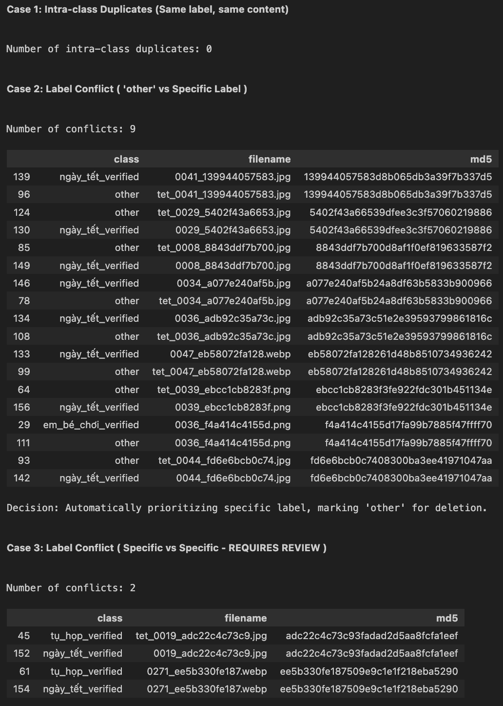
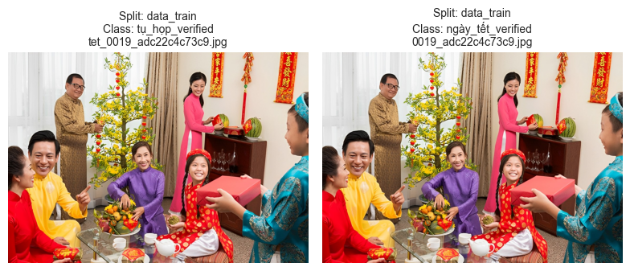

#### Case-by-Case Resolution Logic:
I implemented a hierarchical resolution strategy:
1. **Case: Exact Duplicate with Different Labels (Other vs Specific)**: 
   - **Insight**: The `other` class is high-entropy (noisy). If an image exists in both `other` and `trekking`, its presence in `other` obscures the specific features the model needs to learn for `trekking`.
   - **Action**: Keep the specific class label and discard the instance in `other`.
2. **Case: Duplicate with Different Labels (Specific vs Specific)**: 
   - **Insight**: Direct label contradiction. 
   - **Action**: Performed manual visual inspection to determine the "Ground Truth." For this small dataset, manual audit is the gold standard for stability.
3. **Case: Redundant Files (Same Label)**: 
   - **Action**: Keep one instance and delete the rest to ensure class-level feature density is not artificially skewed.

#### Future Scaling: Vectorized Deduplication
For datasets exceeding thousands of images.
- **The Solution**: Convert images into **High-Dimensional Embeddings** using a pre-trained feature extractor (Embedding models). 
- **Vector Search**: Use algorithms like **Cosine Similarity** or **FAISS** to find "Near-Duplicates"—images that are resized, cropped, or slightly color-shifted but identical in content. This allows for automated deduplication at a massive scale.

### 2.2. Analyzing Data Leakage
Data leakage occurs when the "answers" to the test set are accidentally provided during the training phase via duplicate images across folders.

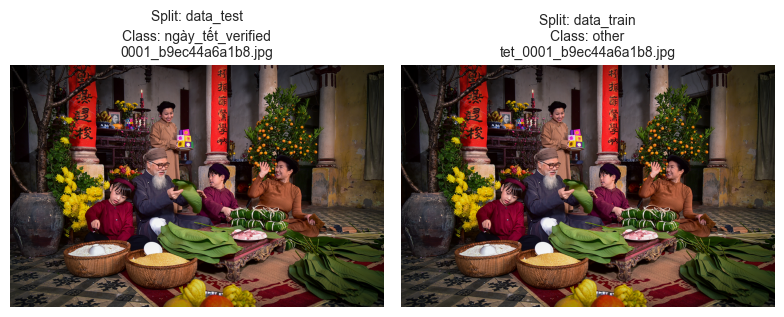

- **Detection**: I strictly cross-referenced the global pool of MD5 hashes between `data_train` and `data_test`.
- **Mitigation**: Any image found in both was removed from `data_train`. If the dataset was large, the default would be deletion from train to preserve the test set's purely "blind" status. This ensures that the final metrics represent real-world "new image" performance.

### 2.3. The "Other" Class: A Signal-less Group
Through visual EDA, I identified that the `other` class on both train and test sets is "feature-less." 

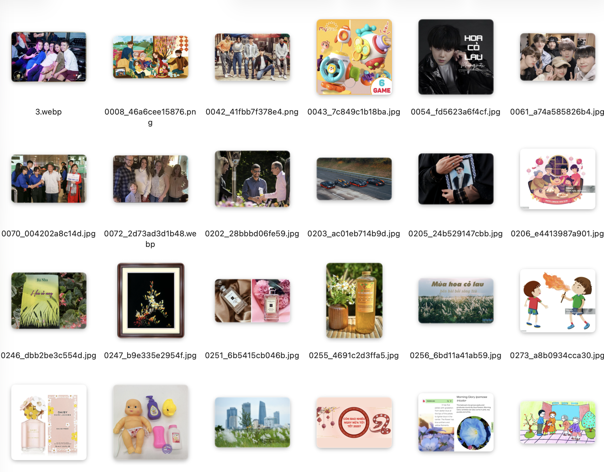

- **Visual Modal Disparity**: It contains a messy mix of digital art and real photos. Real-world pixels have sensor noise and lens distortion, while digital art has perfect mathematical gradients. These two "signals" often conflict.
- **Signature Analysis**: I reviewed both sets and found no consistent visual "signature" (common colors, shapes, or themes) that uniquely defines `other`. It is essentially a background "Negative Class."
- **Early Prediction**: It was predicted that this class would be the most difficult to classify and the primary source of entropy (error) in the confusion matrix.

### 2.4. Class Imbalance
The distribution is skewed: `thien_nhien` is the majority, while `tu_hop` is the minority.

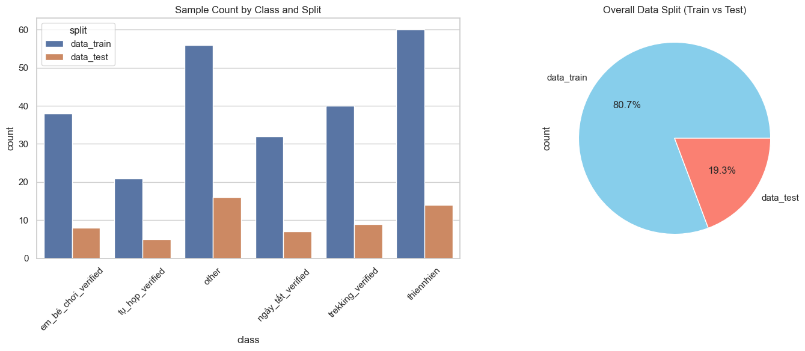

- **The Mathematical Imbalance**: In a standard loss function, the model receives more gradients from the majority class. Over time, it learns that "when in doubt, guess Nature" is a winning strategy for reducing loss.
- **Visualizing the Impact**: This leads to a model that has high "Precision" for Nature but poor "Recall" for classes like `tu_hop`.
- **Solution**: I plan to use class weights to address this issue, but in the future, I will use a more advanced method to handle class imbalance, such as oversampling the minority class or using a different loss function.

**Test Set Distribution & Reliability:**

- An analysis of the data_test split reveals that it mirrors the imbalance of the training set (e.g., thiennhien has ~15 samples while tu_hop has only 5).
- Justification: While a balanced test set is ideal, maintaining the natural distribution ensures the metrics reflect real-world performance where certain events occur more frequently.
- Mitigation: To prevent a single "lucky" or "unlucky" prediction from skewing the results of minority classes, I rely on Macro-averaging for all metrics. This ensures that the model's failure on the 5 tu_hop samples is penalized just as heavily as a failure on the 15 thiennhien samples.
---

## 3. Data Preprocessing Strategy

### 3.1. Formatting & Color Spaces
Images from different sources (web-scraped, digital art, phone photos) often come in different formats (PNG, JPG, WEBP, ... ).
- **Uniform Format**: All images were standardized to a 3-channel RGB space and converted to the same format (JPG). 
- **The Alpha Channel Problem**: Illustrations often contain a 4th "Alpha" channel for transparency. AI backbones expect standard 3-channel input; passing 4-channel data would cause a tensor shape mismatch error (`RuntimeError`). I stripped the Alpha channel to ensure compatibility.
- **Bit-depth Normalization**: Pixel values (0-255) were converted to float tensors and normalized using ImageNet statistics (Mean: `[0.485, 0.456, 0.406]`, Std: `[0.229, 0.224, 0.225]`). This centers the data in the "feature space" where the pre-trained models are most comfortable.

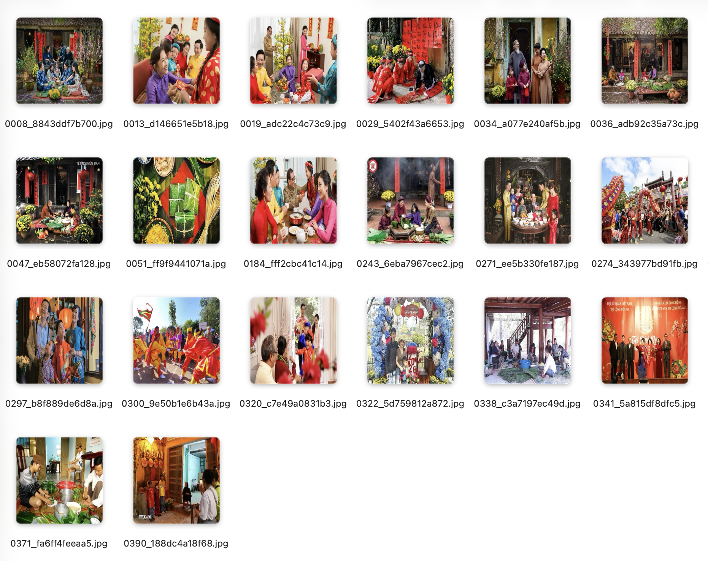

Image dimensions of train dataset:
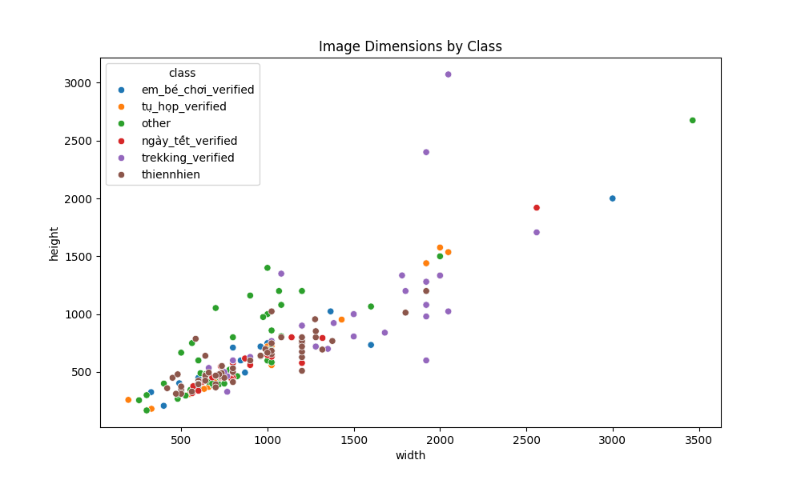

Image dimensions of test dataset:
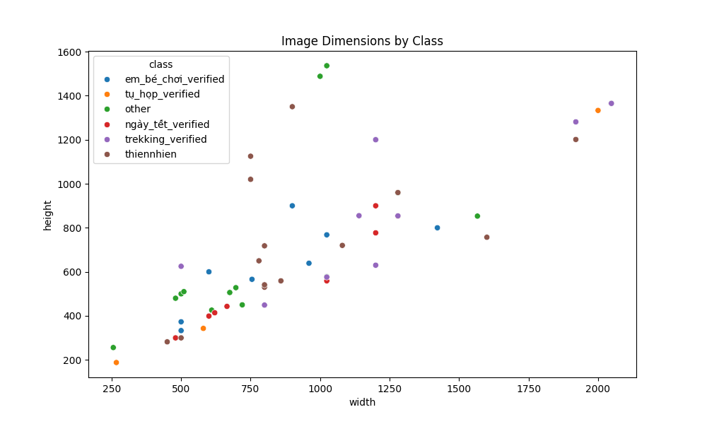

### 3.2. Resolution: The 224x224 "Sweet Spot"
I resized all images to 224x224 pixels. 
- **Why?**: This resolution is the native input size for the majority of the world's most advanced vision models (ResNet, ConvNeXt, EfficientNet). Standardizing to this size allows us to leverage pre-trained weights without losing spatial information.
- **Trade-off**: Going higher (e.g., 512x512) would increase training time and VRAM usage by 5x without necessarily providing a 5x boost in accuracy for simple object classification.

### 3.3. Data Augmentation Strategy
To prevent the model from "memorizing" specific images (Overfitting), I implemented a robust augmentation pipeline for the training set.

- **Virtual Expansion:** Techniques like RandomResizedCrop and Rotation force the model to learn structural features (shapes/objects) rather than memorizing fixed pixel positions.

- **Physics-Based Logic:**
    - **Horizontal Flip:** Included because "trekking" or "gathering" remains semantically identical when mirrored.
    - **Vertical Flip (Excluded):** Deliberately omitted to avoid "unrealistic noise" (e.g., upside-down children or forests), which preserves the model's understanding of gravity-based orientation.

---

## 4. Modeling Methodology

### 4.1. Transfer Learning:
Given our small (~300 image) dataset, training a model from scratch is impossible—it would simply memorize the noise.
- **ImageNet Pre-training**: I utilized models pre-trained on the **ImageNet-1K** dataset (~1.2 million images). These models have already "learned" how to see basic shapes, edges, and textures. We are simply "re-teaching" them how to map those features to our specific 6 classes.

### 4.2. Candidate Models Comparison
I compared three distinct philosophies of model design:
1. **ResNet50 (The Baseline)**: Allow training of very deep networks. It is the gold standard for "stable" image classification.
2. **EfficientNet-B0**: Balance depth, width, and resolution. It achieves high accuracy with very few parameters (~5M).
3. **ConvNeXt-Tiny**: Modern architecture that "modernizes" the classic CNN with design choices inspired by Vision Transformers (larger kernels, GLU activations, LayerNorm).

### 4.3. Stage-wise Fine-Tuning & Preventing Catastrophic Forgetting
I implemented a 2-stage training regime for each fold:
- **Stage 1 (Head-only - 5 Epochs)**: I "froze" the pre-trained backbone and trained only the new classification head. 
    - **Why?**: The new classification head starts with random weights. If we unfroze the backbone immediately, the huge gradients from this random head would "break" the delicate pre-trained weights in the backbone—a phenomenon known as **Catastrophic Forgetting**.
- **Stage 2 (Full fine-tune - 10 Epochs)**: I unfroze the backbone and used a very low learning rate (`5e-5`) with a **Cosine Annealing** scheduler. This allows the model to subtly "tilt" its pre-trained features to better fit our specific classes.

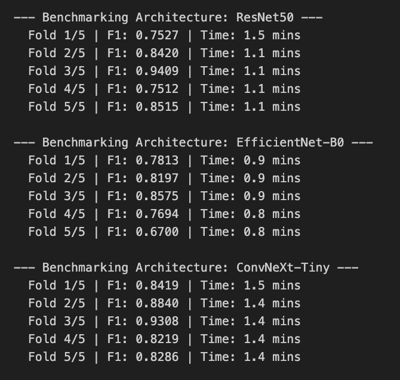

---

## 4. Benchmark Evaluation & Reliability Analysis

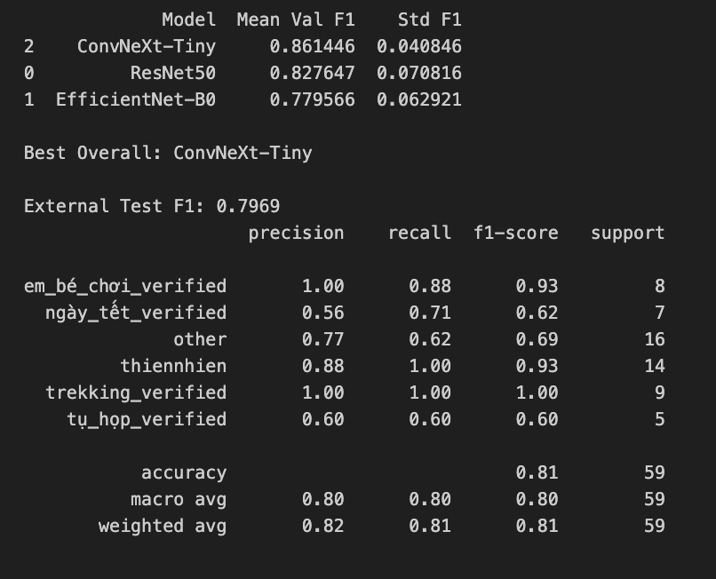

Macro F1 score and latency on the External Test Set:

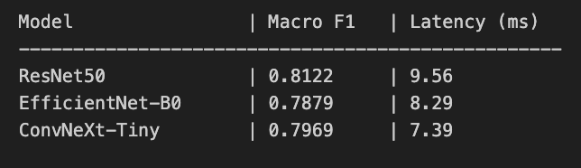

### 4.1. Stratified 5-Fold Cross Validation
On a tiny dataset, base only on a train and test dataset is dangerous, might get "lucky" and get all the "easy" images in your validation set, or "unlucky" and get all the "hard" ones.
- **The Solution**: 5-Fold CV splits the data train into 5 equal parts. The model is trained 5 times, each time using a different part as the validation set. Then treat the test dataset as a blind test set.
- **Outcome**: For each fold, we get a **Macro F1 score** and after all 5 folds, we get an **Average Macro F1 score** and **Standard Deviation (Std)**. A low Std confirms the model is "stable" and not just getting lucky on specific data splits.
- **External Test**: The `data_test` directory was kept as a purely blind **External Test Set** used only for final reporting, providing a realistic estimate of out-of-distribution performance.

### 4.2. Metric Choice
In imbalanced datasets, **Accuracy** is not reliable. If you have 90 "thien_nhien" photos and 10 "tu_hop" photos, a model that predicts "thien_nhien" every time will get 90% accuracy.
- **Macro F1**: Calculates the F1 score for each class individually and then takes the average. This punishes the model if it fails on minority classes like `tu_hop`, making it a much fairer reflection of real performance.

### 4.3. Final Benchmark Comparison

| Model | Avg Macro F1 (trained) | Avg Macro F1 (blind test) | Latency (ms/img) | Complexity | Stability (Std) |
| :--- | :---: | :---: | :---: | :---: | :---: |
| ResNet50 | 0.827647 | **0.8122** | 9.56 | ~25M params | 0.070816 |
| EfficientNet-B0 | 0.779566 | **0.7879** | 8.29 | **~5.3M params** | 0.062921 |
| **ConvNeXt-Tiny** | **0.861446** | 0.7969 | **7.39** | ~28M params | **0.040846** |

ConvNeXt-Tiny was selected as the final model for this image classification task. The decision is based on three critical pillars: superior performance, exceptional stability, and hardware efficiency.

- **Optimal Performance-Efficiency Balance:** Despite having a higher parameter count (~28M) compared to EfficientNet-B0, ConvNeXt-Tiny achieved the lowest Inference Latency (7.39 ms/img) on the test hardware. This indicates that its architecture is highly optimized for modern computing kernels, providing a "sweet spot" between high-level feature extraction and real-time execution speed.

- **Highest Training Stability:** ConvNeXt-Tiny demonstrated the lowest Standard Deviation (0.0408) across 5-fold cross-validation. This low variance proves that the model is robust and less sensitive to specific data splits, which is vital when dealing with a relatively small dataset of 300 images. It consistently learns generalized features rather than over-memorizing specific samples.

- **Modern Architectural Advantage:** ConvNeXt-Tiny incorporates the best of both worlds: the reliability of Convolutional Neural Networks (CNNs) and the advanced design philosophy of Vision Transformers (ViTs). By utilizing larger kernels and improved normalization layers, it successfully captured complex contextual cues in challenging categories like "Ngày Tết" and "Tụ Họp" where traditional ResNet50 struggled.

- **Generalization Capability:** While there is a slight performance dip from the Training Fold (0.86) to the Blind Test (0.79), it still maintains a competitive edge over EfficientNet-B0. The model's ability to maintain a Macro F1 near 0.80 on completely unseen data validates its potential for real-world deployment.

**Conclusion:** ConvNeXt-Tiny is the most reliable candidate, offering the best trade-off between accuracy, prediction speed, and consistent performance across imbalanced classes.

---

## 5. Error Diagnostics & Failure Recovery

Post-training, I conducted a deep "Error EDA" to see where even our best model failed.

### 5.1. Top-Loss Analysis (The "Hard" Cases)
After identifying the most confidently incorrect predictions (highest loss), a qualitative review of these "hard cases" revealed several systematic challenges that even the best-performing model, ConvNeXt-Tiny, struggled to overcome.

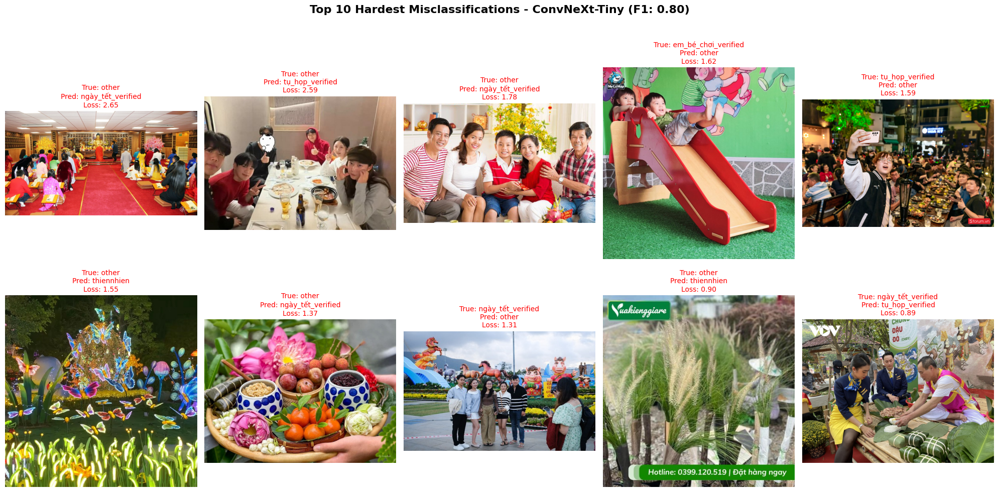

**Key Findings from Error Diagnostics:**

- **The "Other" Category Ambiguity:**

    - A significant portion of high-loss errors stems from the `other` class.

    - The model frequently misclassified `other` images as `ngày_tết_verified` or `tụ_họp_verified`.

    - Reason: Many images labeled as `other` contain visual elements like indoor gatherings, red decorations, or large groups of people. Without a more distinct boundary for "miscellaneous" content, the model over-indexes on these dominant visual cues.

- **Contextual Overlap (Tết vs. Tụ Họp):**

    - The model showed confusion between `ngày_tết_verified` and `tụ_họp_verified`.

    - Reason: These two classes share nearly identical feature spaces—indoor settings, people sitting around tables, and festive food. For instance, a family gathering during the Lunar New Year is semantically Tết but visually resembles Tụ Họp (Gathering).

- **Scale and Watermark Interference:**

    - The presence of large watermarks or text overlays appears to distract the model's feature extraction.

    - Reason: High-loss cases often featured promotional banners or logos which introduce "artificial noise," leading the model to prioritize these high-contrast edges over the actual content of the image.

### 5.2. Confusion Matrix

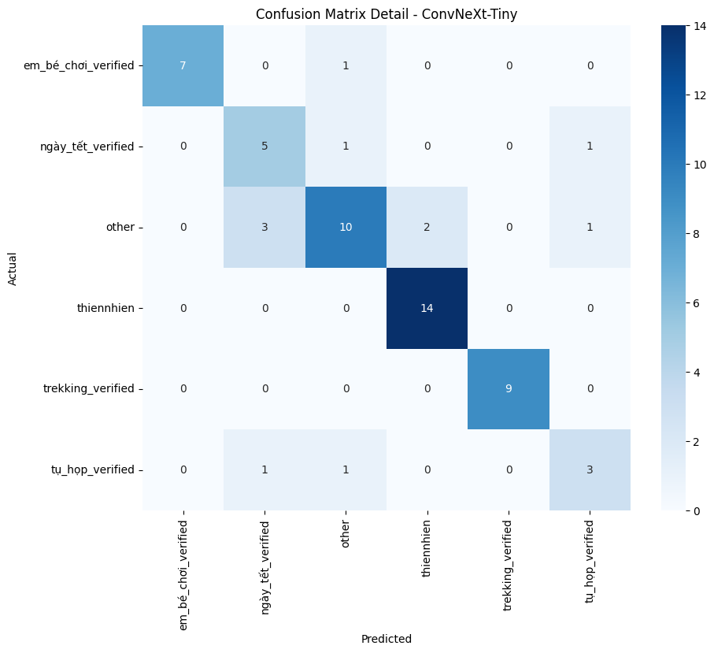

- **The "Other" Class as a Noise Class:**

    - As hypothesized in early data preparation, the other category acts as a "noise class". The matrix shows it is the most common destination for misclassifications across almost all categories.

    - Link to Top-Loss: This confirms why the model "defaults" to other when visual subjects (like the child in the em_bé_chơi class) are small or obscured by busy backgrounds.

- **Festive-Social Confusion (Tết vs. Tụ Họp):**

    - The matrix reveals a noticeable "leakage" between ngày_tết_verified and tụ_họp_verified.

    - Insight: This validates the Contextual Overlap mentioned in Section 5.1. Even the advanced attention mechanism of ConvNeXt-Tiny struggles to distinguish between a "ngày_tết_verified" and a "tụ_họp_verified" because their visual features (tables, groups, indoor lighting) are virtually identical.

- **High-Precision Successes:**

    - Classes with distinct environmental features like thiennhien and trekking_verified show very high diagonal values, with trekking_verified achieving 100% recall in the ConvNeXt-Tiny test.

   - Observation: This performance is driven by the fact that these two groups possess highly distinct visual features—such as expansive forests and mountain landscapes—compared to the more cluttered indoor scenes of other classes. Furthermore, having a relatively larger and more consistent sample size for these categories allowed the model to develop more robust feature representations, resulting in superior classification accuracy.

### 5.3. Future Improvement
Based on the diagnostic results, the following technical enhancements are proposed:

**1.Transition to a Confidence Threshold Strategy:**

- **The Logic:** The current `other` class is too high-entropy and lacks a consistent visual signature, causing it to act as a "noise sink" for the model.

- **The Solution:** We will **remove the `other` class** from the training and testing sets entirely. During inference, the model will output a probability for each of the 5 specific classes. We will implement a **Confidence Threshold** (e.g., 0.7). If the highest predicted probability is below this threshold, the sample is automatically rejected and categorized as other. This ensures the model only makes "high-certainty" predictions, significantly boosting system reliability.

**2. Advanced Augmentation:** These techniques blend images together, forcing the model to identify object-specific textures and shapes rather than relying on global background colors or lighting.

**3. Higher Resolution Experimentation:** Moving to 384x384 resolution to provide the model with finer spatial details, which is crucial for detecting small subjects in crowded festive or outdoor scenes.

---
